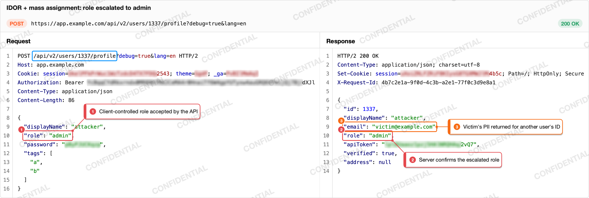
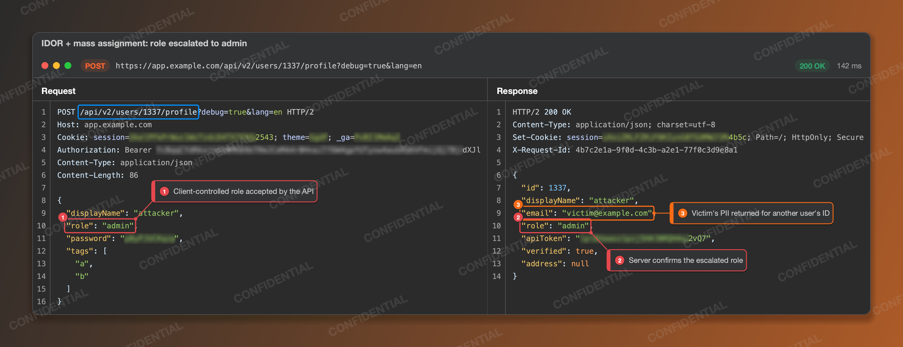
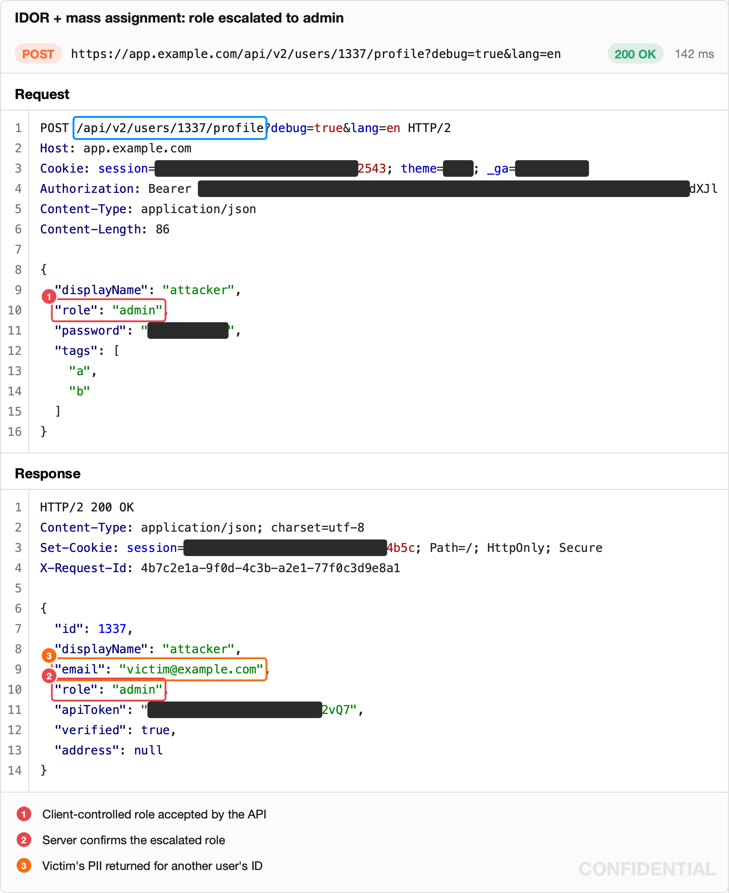
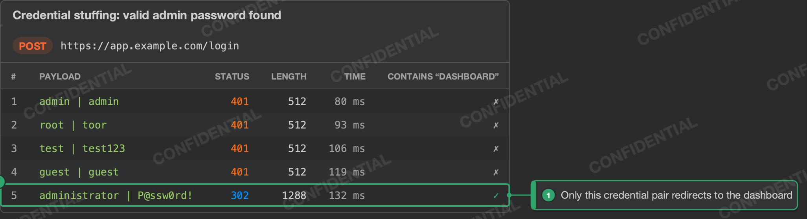
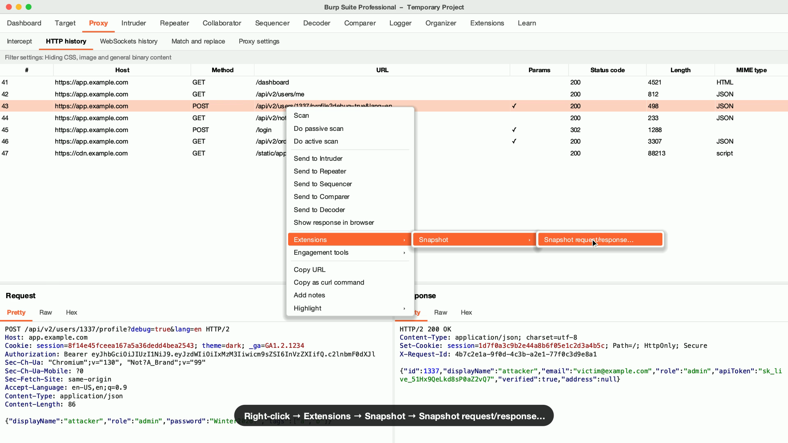

# Snapshot for Burp Suite

[](https://github.com/noverdy/burp-snapshot/actions/workflows/build.yml)
[](https://github.com/noverdy/burp-snapshot/releases/latest)

A Burp Suite extension that turns a request and response into a clean PNG for your pentest report. Box what matters, add notes, and secrets get blurred for you. No more screenshot, paint tool and manual blurring.


[Watch the demo in full quality (25 s)](docs/demo-v1.3.mp4)

## Features

- Click a parameter, header, cookie or JSON key to box it and add a note.
- Automatic redaction of auth headers, cookies and tokens, keeping the last 4 characters.
- JSON, HTML, XML, CSS and JavaScript bodies are pretty-printed and colored like Burp's own editor.
- Long bodies are trimmed to the part that matters, and a highlighted selection is centered for you.
- Templates reuse your marks, redactions, title, caption and settings on the next request.
- AI markup (Burp Pro): describe the finding and Burp AI boxes the evidence, writes the notes, title and caption.
- Intruder results as a table, with response times.
- Light and dark themes, side by side or stacked, with a tiled watermark.
- Copy or save as PNG, or press `⌘⇧C` to copy without opening a window.
- Drafts and exported snapshots saved in your Burp project.

> [!IMPORTANT]
> Redacted text never reaches the image. The blur is drawn over random placeholder characters, so it can't be reversed.

| Light | Dark |
|---|---|
|  |  |
| **Stacked with legend** | **Intruder results** |
|  |  |

## Install

Download the jar from the [latest release](https://github.com/noverdy/burp-snapshot/releases/latest), then add it in Burp under **Extensions → Installed → Add** (type **Java**). Needs Burp 2026.7 or later, Professional or Community.

## Usage

Right-click any request (Proxy, Repeater, Logger, Intruder…) and choose **Extensions → Snapshot**. Pick **Snapshot as results table…** when several rows are selected.



| Shortcut | Action |
|---|---|
| `⌘⇧X` | Open the selected request in Snapshot |
| `⌘⇧C` | Quick copy: PNG to the clipboard, no window |
| `M` / `R` | Mark or Redact tool: click a value, or drag across text |
| `⌘Z` / `⇧⌘Z` | Undo / redo |
| `⇧⌘C` / `⌘S` | Copy image / save PNG (inside the editor) |

Use `Ctrl` instead of `⌘` on Windows and Linux. Change the two global hotkeys from the gear in the **Snapshot** tab.

**Long bodies** show up to **Max body lines** (100 at most). **Request offset** and **Response offset** in the **Content** settings skip lines from the top, so you can show any part of the body. Highlight text in Burp's message editor before opening Snapshot and it's marked, with the offset set so the highlight sits in the middle.

**Templates** are saved per Burp project from **Templates → Save current as template…** in the editor. Pick which parts to keep: marks, redactions, title, caption, header visibility and the snapshot settings (including body offsets). Applying one finds each mark and redaction again by header, parameter, JSON key or text, and fills `{method}`, `{path}`, `{host}` and `{status}` in the title and caption. Anything it can't find is skipped and listed. The menu lists your 8 most recent templates, and **All templates…** searches, renames and deletes the rest.

**Response time** comes from Burp's timing data, Repeater's status bar, or the Proxy history row you selected.

**AI markup** needs Burp Pro with **Use AI** enabled for Snapshot in **Extensions → Installed**. Burp AI only sees what the image shows, with redacted values replaced.

**Drafts and exported** live in the **Snapshot** tab. Drafts keep your last 20 unexported snapshots, and anything you copied or saved stays under Exported. Burp Community projects are temporary, so they don't survive a restart.

## Build

```bash
./gradlew build      # jar in build/libs/
./gradlew demo       # re-record the demo video (needs ffmpeg and Burp)
```

Pushing a `v*` tag builds the jar and publishes a release.

## License

[MIT](LICENSE)
