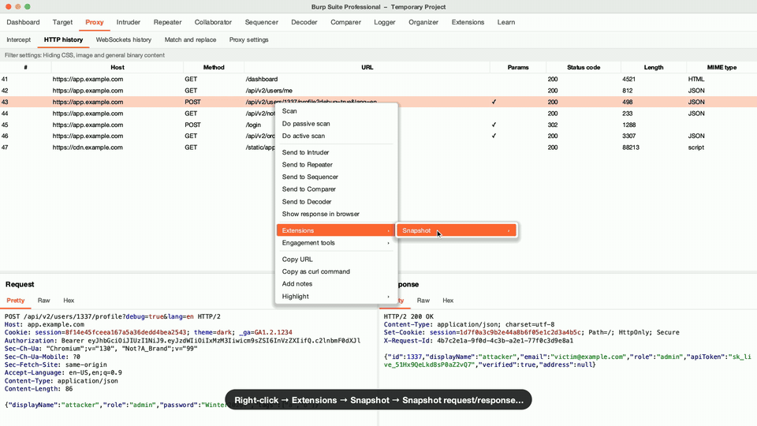
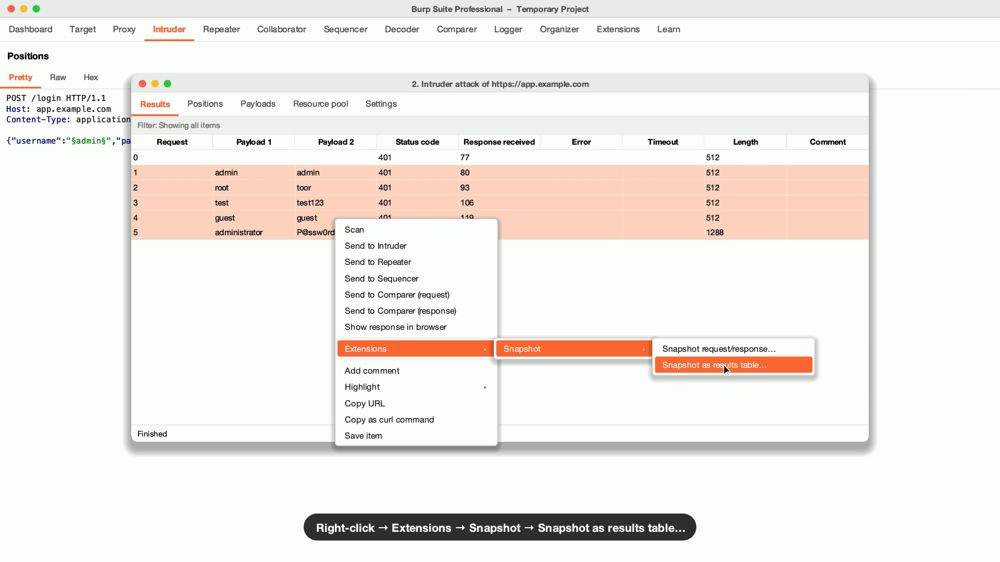

# Snapshot for Burp Suite

[](https://github.com/noverdy/burp-snapshot/actions/workflows/build.yml)
[](https://github.com/noverdy/burp-snapshot/releases/latest)

A Burp Suite extension that turns a request and response into a clean PNG for your pentest report. You box the parameters that matter, write a note next to each, and the extension blurs the secrets. It replaces the usual routine of taking a screenshot, drawing squares in a paint tool and blurring tokens by hand.



[Watch the full demo (67 s)](docs/demo.mp4)

## Features

- Request and response side by side or stacked, drawn in Burp's own light or dark editor colors with line numbers.
- Click a parameter, cookie, header or JSON key to box the whole key and value, then type a note. Notes appear as callouts you can drag, or as a numbered legend under the image.
- Automatic redaction of `Authorization`, `Cookie`, `Set-Cookie`, API key headers and any parameter that looks like a password, token or session. Long values keep their last 4 characters so you can tell two tokens apart. Click any other value to redact it as well.
- A tiled watermark with `{date}` and `{host}` placeholders and an optional logo.
- Intruder results as a table, with the payloads worked out from the selected requests.
- Copy to the clipboard or save a PNG at 1x, 2x or 3x.

> [!IMPORTANT]
> The extension redacts text before it draws anything. Real characters never reach the image, and the blur is painted over random placeholder text, so nobody can un-blur it.

| Light, with callouts | Dark |
|---|---|
|  |  |
| **Stacked, numbered legend, solid redaction** | **Intruder results table** |
|  |  |

## Install

1. Download `burp-snapshot-<version>.jar` from the [latest release](https://github.com/noverdy/burp-snapshot/releases/latest).
2. In Burp, open **Extensions → Installed → Add**, set the type to **Java** and pick the jar.

It runs in Burp Suite Professional and Community. The extension is built against Montoya API 2026.7, so use Burp 2026.7 or later.

## Usage

### Request and response

Select a request in Proxy, Repeater, Logger, Target or any other tool, then right-click and choose **Extensions → Snapshot → Snapshot request/response…**


In the Snapshot window:

| Action | How |
|---|---|
| Box a parameter and add a note | Mark tool (`M`), click the parameter |
| Box any text | Mark tool, drag across it |
| Redact or un-redact a value | Redact tool (`R`), click it or drag across text |
| Move a note | Drag the callout |
| Change color, edit or delete a mark | Right-click the box |
| Hide a header | Right-click the header line |
| Zoom | Pinch, or `⌘`/`Ctrl` + scroll |
| Undo / redo | `⌘Z` / `⇧⌘Z` (`Ctrl` on Windows and Linux) |
| Copy image / save PNG | `⇧⌘C` / `⌘S` |

> [!TIP]
> Select text in Burp's message editor before you right-click and the snapshot opens with that text already boxed.

### Intruder results

In the attack results window, select two or more rows (Shift-click for a range), then right-click and choose **Extensions → Snapshot → Snapshot as results table…** The same item shows up in Proxy history and Logger.



Type a string in the **Contains** box to add a ✓/✗ column, similar to Burp's grep match. Right-click a row to edit its payload label or hide it.

> [!NOTE]
> Burp doesn't share Intruder's payload columns with extensions. Snapshot compares the selected requests to find the payloads, including attacks with more than one payload position. If a label comes out wrong, fix it with **Edit payload…**

### Settings

The sidebar keeps the per-screenshot options at the top: theme, layout, mark color, note style, redaction style, watermark text and export scale. Redaction rules, hidden headers, body truncation, line wrapping and watermark styling sit in collapsible sections below. Snapshot stores everything in Burp's preferences, so your choices carry over between projects.

Response time comes from Burp's timing data when it exists. Otherwise the extension times requests itself while loaded, so a Repeater response sent before you loaded Snapshot has no time to show. Send it once more.

## Build from source

You need JDK 21 or later.

```bash
./gradlew build      # jar lands in build/libs/
./gradlew samples    # renders the sample images into build/samples/
./gradlew demo       # re-records the demo video (needs ffmpeg and a local Burp install)
```

Pushing a tag such as `v1.0.0` makes GitHub Actions build the jar and attach it to a release.
